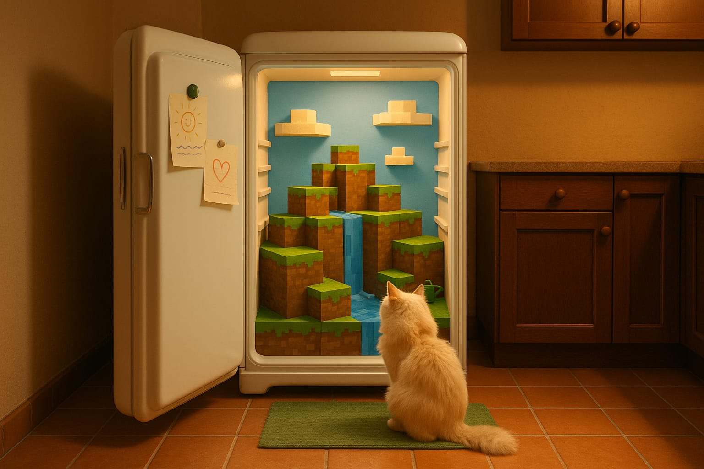
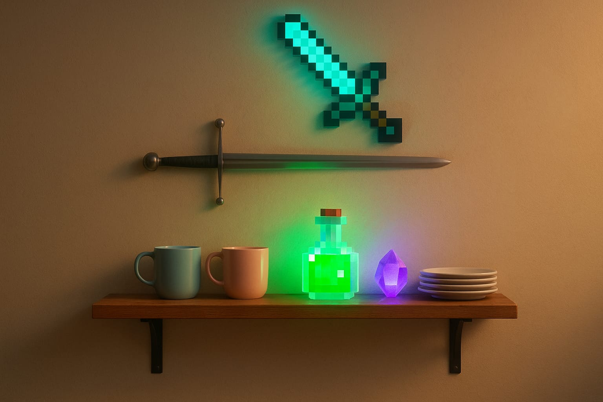
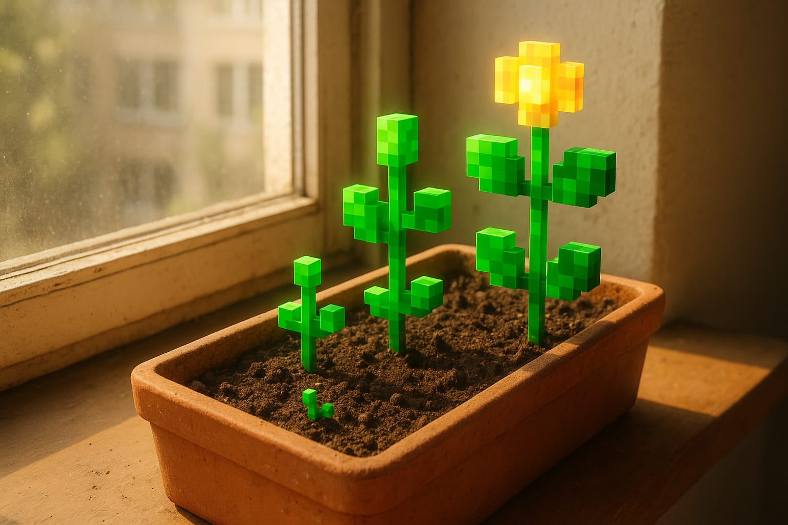
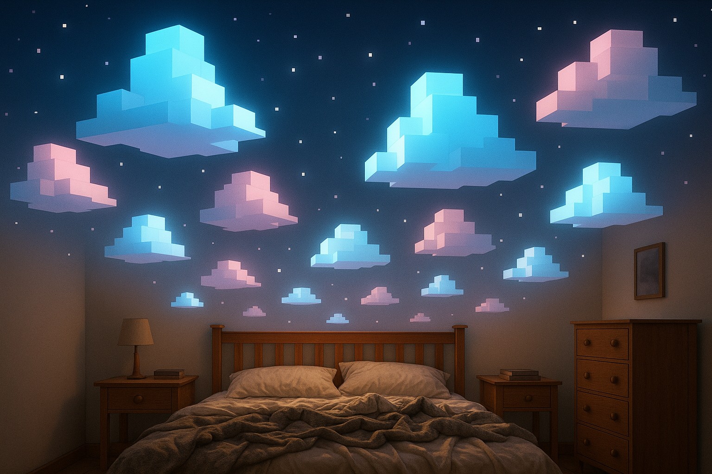
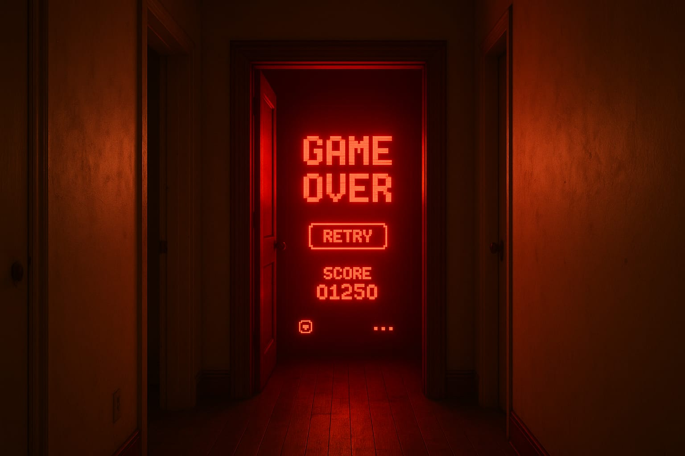
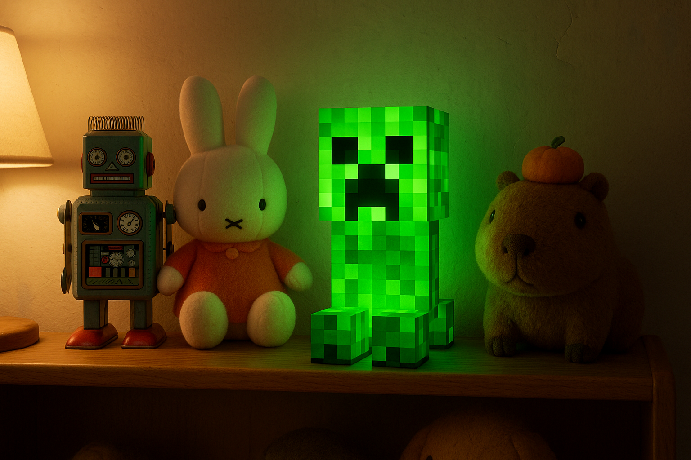
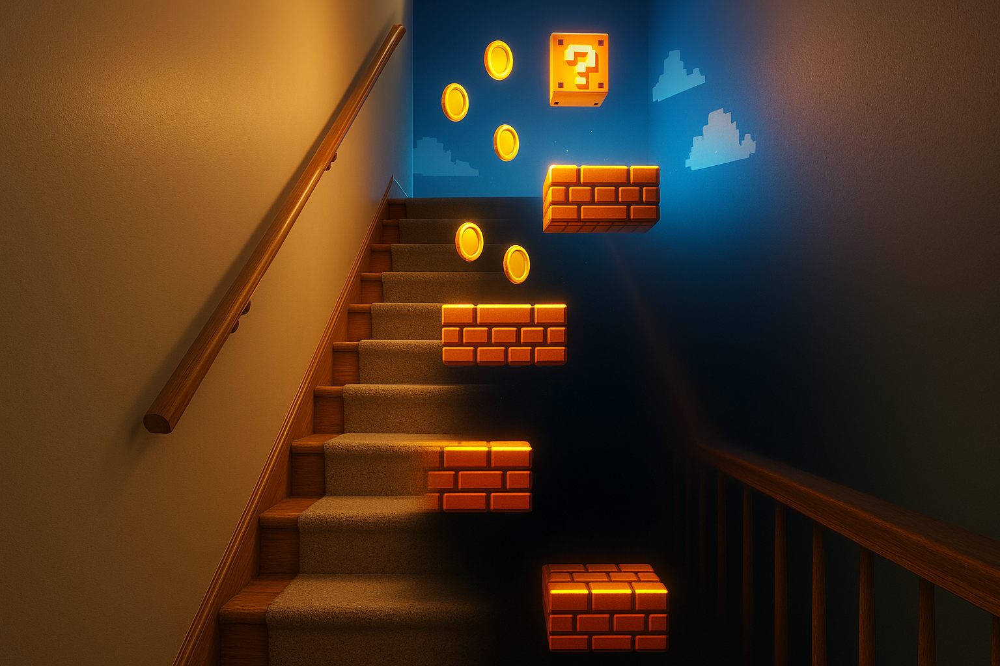

# DALL-E Concept Art

Pre-production concept art generated using gpt-image-1 (DALL-E) via the openai-image-gen skill. Each image was created before the corresponding Blender scene build to establish composition, mood, and the contrast between photorealistic domestic spaces and emissive game-world elements.

This satisfies the second ML architecture requirement (diffusion/autoregressive image generation alongside transformer-based code generation via Codex).

---

## fridge_portal

**Prompt:** Perfectly face-on composition looking straight at an open white retro-style fridge, centered in frame. The voxel Minecraft-like world inside the fridge must also be face-on and axis-aligned to the camera: front faces of grass-and-dirt blocks clearly visible (not angled), square cubes facing camera directly, with a simple blue sky and soft clouds. Keep exactly ONE fluffy cat only, sitting and looking toward the fridge. Cozy warm-toned kitchen with terracotta floor tiles, dark wood cabinetry, green rug, soft golden lighting, doodled notes clipped inside fridge door, small green magnet near top of fridge, tiny green watering can near waterfall spill. Hyperreal kitchen contrasted with blocky stylized voxel world. Nostalgic, dreamy, whimsical.

---

## shelf_artifacts

**Prompt:** A straight-on centered still life of a minimalist wooden wall shelf in a warm realistic interior, smooth light beige plaster wall, medium-tone natural wood shelf with dark metal brackets, on the shelf are two simple ceramic mugs in pastel blue and pastel pink, a glowing minecraft potion bottle in vivid emissive green, a small faceted purple crystal gem with soft inner glow, and a short stack of white plates, mounted on the wall just above the shelf is a realistic silver longsword with a simple crossguard and narrow blade, and directly above it hangs a minecraft diamond sword, perfectly pixelated and glowing cyan-blue, the real sword is metallic and grounded while the diamond sword feels like a game asset intruding into reality, the glowing potion, crystal, and diamond sword cast colored light onto the wall, shelf, mugs, plates, and sword below, clean front-facing composition, centered framing, no angle, no extra clutter, cozy warm ambient lighting, soft shadows, photorealistic blender-style render, magical but believable, nostalgic and slightly uncanny

---

## garden_growing_voxels

**Prompt:** A realistic sunlit windowsill garden (inside a cozy apartment), warm natural light pouring through the window onto a terracotta planter box filled with dark soil, dust, and small imperfections, but growing from the soil are minecraft-style voxel plants with perfectly blocky stems, cube leaves, and pixelated structure, bright green emissive foliage glowing unnaturally against the real planter and window frame, a single voxel flower with luminous square petals, tiny blocky sprouts emerging beside real bits of dirt and texture, the planter, sill, wall, and sunlight are photorealistic while the plants feel like game assets intruding into reality, soft golden light mixed with unnatural emissive glow, surreal but gentle, detailed Blender concept art about reality contrasted with gamification

---

## clouds_balcony

**Prompt:** Frame a real apartment balcony at golden hour, head on, photorealistic concrete floor, glass pane metal edge railing, warm sunset light, and a bright blue sky in view with clouds but the clouds are not natural: they are minecraft style low-poly blocky retro-game clouds, flat geometric forms with clean stepped edges, glowing with soft emissive white light, floating in an otherwise realistic sunset sky, the balcony itself remains grounded and believable while the clouds feel like a visual glitch or game layer imposed over reality, beautiful but wrong, the golden-hour sunlight on the balcony contrasts with the cool unnatural glow of the voxel clouds, dreamy, cinematic, slightly uncanny, high-detail Blender concept art.

---

## bedroom_sky

**Prompt:** Face on: a cozy bedroom with real wooden furniture and a messy bed with blankets, the ceiling is completely gone replaced by a retro game sky with blocky emissive clouds glowing soft blue and pink, with clouds but the clouds are not natural: they are minecraft style low-poly blocky retro-game clouds, flat geometric forms with clean stepped edges, glowing with soft emissive white light. Stars are pixel squares, the room is lit from above by the fake game sky casting unnatural light on the real furniture below, dreamy and surreal.

---

## closet_gameover

**Prompt:** Face on: a dim photorealistic hallway in a real home, slightly worn walls, wooden floor, and an open door at the end with a believable wood frame, but inside the doorframe the interior is filled with a glowing red retro video game GAME OVER screen, flat and screen-like yet occupying physical space inside the closet, bright emissive red text floods the hallway with colored light, floating UI elements such as a retry button, score counter, and pixel interface hover in the darkness of the closet interior, the hallway remains grounded and realistic while the closet becomes a portal of pure gamified visual logic, eerie, nostalgic, uncanny, cinematic, high-detail Blender concept art

---

## toy_shelf (stretch goal)

**Prompt:** Face on: a real wooden toy shelf, warm bedside lamp lighting, soft shadows, slightly worn painted wall, and believable domestic detail, the shelf is filled with a robot toy, bunny stuffy (miffy), capybara stuffy with orange on his head, but sitting among them is a glowing minecraft creeper, perfectly pixelated with vivid emissive green skin and an illuminated face, the creeper casts eerie green light onto the plush toys, wood shelf, and nearby wall, the real toys remain soft, tactile, and believable while the creeper feels like a game asset intruding into childhood reality, nostalgic, magical, slightly eerie, gentle but uncanny, high-detail Blender-style concept art

---

## platformer_staircase (stretch goal)

**Prompt:** Face on: a photorealistic interior house staircase seen from the bottom looking upward, lower steps made of real wood with a soft carpet runner and normal painted walls, warm domestic lighting, realistic banister and trim, but halfway up the staircase reality breaks and transforms into a retro platformer game level, the upper stairs dissolve into floating emissive platforms suspended over a dark void, bright coins hover in the air, glowing power-up blocks hang above the steps, and beyond them is a saturated game skybox with impossible light, the real wooden railing fades away and disappears as the game world takes over, strong contrast between believable home interior materials and stylized glowing game geometry, surreal, playful, nostalgic, uncanny, cinematic high-detail Blender concept art
